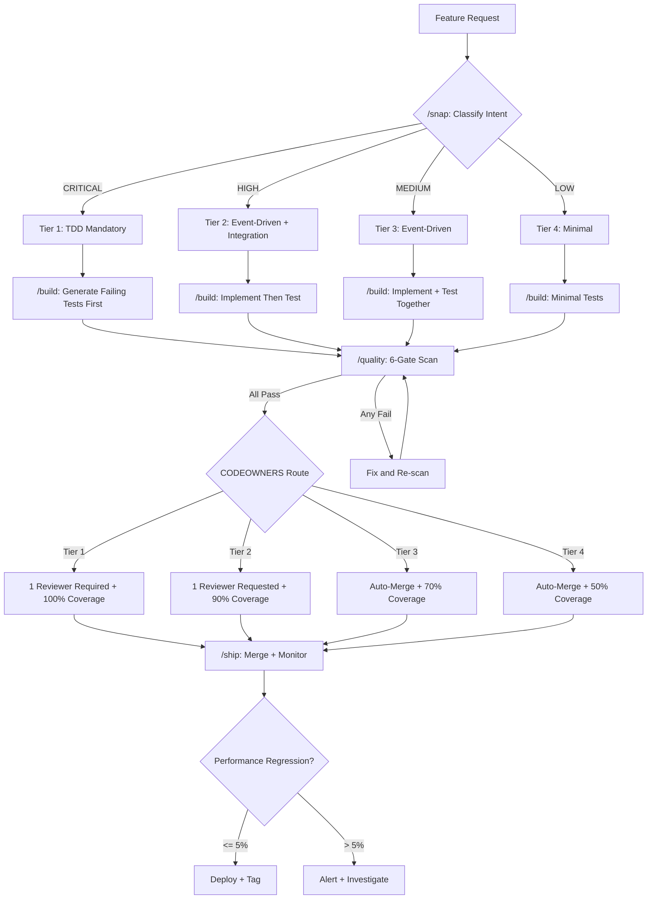

# FINAL SYNTHESIS: Iteration 5 -- Unified Claude Code Workflow

**Date**: February 9, 2026
**Synthesizes**: Iterations 1-4 (TDD Tiers, Code Review Tiers, Coverage Stratification, Polyglot Abstraction Gates)
**Status**: FINAL DELIVERABLE -- Ready for Implementation
**Project**: happygene v0.2.0 (Python-first gene network simulation)

---

## Table of Contents

1. [Conflict Resolution Matrix](#1-conflict-resolution-matrix)
2. [Unified Workflow Diagram](#2-unified-workflow-diagram)
3. [Implementation Sequence (13-Week Roadmap)](#3-implementation-sequence)
4. [Cost and ROI](#4-cost-and-roi)
5. [Success Metrics and Go/No-Go Gates](#5-success-metrics-and-gono-go-gates)
6. [Contingency Plans](#6-contingency-plans)
7. [Claude Code Stack Integration](#7-claude-code-stack-integration)
8. [Deployment Strategy](#8-deployment-strategy)
9. [Copy-Paste Configurations](#9-copy-paste-configurations)
10. [Decision Tree for Agents](#10-decision-tree-for-agents)
11. [Risk Matrix](#11-risk-matrix)

---

## 1. Conflict Resolution Matrix

### Do the 4 decisions conflict? ANSWER: NO -- They compose cleanly.

Each decision governs a different phase of the development lifecycle. They reinforce each other through a shared tier classification scheme.

### 4x4 Interaction Grid

```
                  | TDD Tier        | Review Tier      | Coverage Target   | Polyglot Gate
==================|=================|==================|===================|==================
TDD Tier          | --               | SYNERGY          | SYNERGY           | NEUTRAL
                  |                  | Tier 1 TDD       | Tier 1 TDD maps   | TDD templates
                  |                  | requires review   | to 100% coverage   | per language
                  |                  | (double gate)     | (same modules)     | (no conflict)
------------------|-----------------|------------------|-------------------|------------------
Review Tier       | SYNERGY          | --               | SYNERGY           | SYNERGY
                  | Tier 1 review    |                  | Review gate only   | CODEOWNERS
                  | validates TDD    |                  | for modules where  | routes by
                  | was followed     |                  | coverage >= 90%    | language expert
------------------|-----------------|------------------|-------------------|------------------
Coverage Target   | SYNERGY          | SYNERGY          | --                | SYNERGY
                  | TDD naturally    | Review checks    |                   | Abstraction gate
                  | produces 100%    | coverage report  |                   | enforces per-
                  | for Tier 1       | before approve   |                   | language threshold
------------------|-----------------|------------------|-------------------|------------------
Polyglot Gate     | NEUTRAL          | SYNERGY          | SYNERGY           | --
                  | TDD discipline   | Polyglot gate    | Unified script    |
                  | is language-     | includes review  | (quality_gate.py) |
                  | agnostic         | routing by lang  | enforces all      |
```

### Detailed Interaction Analysis

**Interaction 1: TDD Tier + Review Tier**
- SYNERGY. Tier 1 modules require both TDD (failing test first) AND 1+ reviewer. These are not redundant: TDD ensures the developer wrote tests; review ensures the tests are correct. Event-driven Tier 2/3 modules can auto-merge after CI passes because their coverage gates (90%/70%) provide sufficient confidence.
- No conflict: auto-merge only activates for modules where TDD is NOT mandatory.

**Interaction 2: TDD Tier + Coverage Target**
- SYNERGY. Tier 1 TDD naturally produces 100% coverage (test-first for every code path). Tier 2 event-driven + 90% coverage means developers write tests after implementation but CI blocks if coverage drops below threshold. The coverage target acts as the enforcement mechanism for the TDD tier decision.

**Interaction 3: Review Tier + Coverage Target**
- SYNERGY. Reviewers see the coverage report in the PR. For Tier 1 (100% required), reviewers validate that coverage is genuinely 100% and not achieved through trivial assertions. For Tier 3 (70%), auto-merge trusts the coverage gate without human verification.

**Interaction 4: Coverage Target + Polyglot Gate**
- SYNERGY. The `scripts/quality_gate.py` abstraction layer enforces per-language coverage thresholds using the same tier classification. Python modules classified as Tier 1 require 100% via pytest-cov; Java Tier 1 modules require 100% via JaCoCo; C# Tier 1 modules require 100% via coverlet. One abstraction, consistent thresholds.

**Interaction 5: Review Tier + Polyglot Gate**
- SYNERGY. CODEOWNERS routes reviews to language experts. Python changes go to @python-lead; Java changes go to @java-lead. The polyglot abstraction gate runs all language-specific checks in parallel, then the review routing ensures the correct expert validates the results.

**Interaction 6: TDD Tier + Polyglot Gate**
- NEUTRAL. TDD discipline (write failing test first) is a developer behavior that is language-agnostic. The polyglot gate checks the outcome (tests pass, coverage met) not the process (was the test written first). No conflict, but also no special synergy. TDD templates per language (pytest, JUnit, xUnit) provide guidance without gate enforcement.

### Verdict: CLEAN COMPOSITION

All four decisions share a common tier taxonomy (CRITICAL / HIGH / MEDIUM / LOW mapped to Tier 1/2/3/4). This shared taxonomy is the integration key. Any module classified once flows through all four gates consistently.

---

## 2. Unified Workflow Diagram

### ASCII Flow

```
FEATURE REQUEST (Issue / Slack / Agent Prompt)
       |
       v
+----------------------------------------------+
| /snap: CLASSIFY INTENT                       |
|                                              |
| Input:  Issue description, affected files    |
| Output: Domain classification                |
|         CRITICAL | HIGH | MEDIUM | LOW       |
|         Maps to: Tier 1 | Tier 2 | Tier 3 | Tier 4 |
+----------------------------------------------+
       |
       v
+----------------------------------------------+
| /build: PLAN + IMPLEMENT                     |
|                                              |
| Step 1: Read tier from module classification |
|         (AGENT_NATIVE_QUICK_REFERENCE.md)    |
|                                              |
| Step 2: Generate tests based on tier:        |
|   Tier 1 -> Failing test FIRST (TDD)        |
|             Coverage target: 100%            |
|             Docstring: NumPy + Intent        |
|                                              |
|   Tier 2 -> Implementation first, then tests |
|             Coverage target: 90%             |
|             Docstring: NumPy + Intent        |
|                                              |
|   Tier 3 -> Implementation + tests together  |
|             Coverage target: 70%             |
|             Docstring: NumPy only            |
|                                              |
|   Tier 4 -> Minimal tests                    |
|             Coverage target: 50%             |
|             Docstring: Optional              |
|                                              |
| Step 3: Dispatch agent(s)                    |
|   - Plan agent: reads codebase, designs      |
|   - Explore agent: finds dependencies        |
|   - Implement agent: writes code + tests     |
|                                              |
| Step 4: Agent writes code per language:      |
|   Python: pytest + ruff + mypy               |
|   Java:   JUnit + JaCoCo + Checkstyle       |
|   C#:     xUnit + coverlet + dotnet-format   |
+----------------------------------------------+
       |
       v
+----------------------------------------------+
| /quality: SCAN + ENFORCE                     |
|                                              |
| Gate 1: Lint (ruff/Checkstyle/dotnet-format) |
| Gate 2: Type check (mypy/javac/Roslyn)      |
| Gate 3: Unit tests pass                      |
| Gate 4: Coverage by tier (quality_gate.py)   |
|   - Tier 1 >= 100%                          |
|   - Tier 2 >= 90%                           |
|   - Tier 3 >= 70%                           |
|   - Tier 4 >= 50%                           |
| Gate 5: Security scan (CodeQL/Dependabot)    |
| Gate 6: Performance regression (<5% delta)   |
|                                              |
| ALL gates must pass to proceed.              |
+----------------------------------------------+
       |
       v
+----------------------------------------------+
| CODEOWNERS ROUTING                           |
|                                              |
| Based on files changed:                      |
|                                              |
| Python critical:                             |
|   happygene/entities.py     -> @python-lead  |
|   happygene/datacollector.py-> @python-lead  |
|   happygene/base.py         -> @python-lead  |
|                                              |
| Python computation:                          |
|   happygene/expression.py   -> @python-team  |
|   happygene/selection.py    -> @python-team  |
|   happygene/mutation.py     -> @python-team  |
|                                              |
| Java (Phase 3+):                             |
|   java/src/**              -> @java-lead     |
|                                              |
| C# (Phase 3+):                               |
|   dotnet/src/**            -> @dotnet-lead   |
|                                              |
| Low-risk (auto-merge):                       |
|   examples/**              -> (no reviewer)  |
|   docs/**                  -> (no reviewer)  |
|   tests/**                 -> (no reviewer)  |
+----------------------------------------------+
       |
       v
+----------------------------------------------+
| APPROVAL GATE (Tier-Based)                   |
|                                              |
| Tier 1 (CRITICAL):                           |
|   - 1 reviewer required (CODEOWNERS)         |
|   - Coverage = 100% enforced                 |
|   - TDD verified (test commits before code)  |
|   - 24h soak recommended                    |
|                                              |
| Tier 2 (HIGH):                               |
|   - 1 reviewer requested (not blocking)      |
|   - Coverage = 90% enforced                  |
|   - Auto-merge after 24h if no objection     |
|                                              |
| Tier 3 (MEDIUM):                             |
|   - 0 reviewers (auto-merge)                 |
|   - Coverage = 70% enforced                  |
|   - CI pass = merge                          |
|                                              |
| Tier 4 (LOW):                                |
|   - 0 reviewers (auto-merge)                 |
|   - Coverage = 50% enforced                  |
|   - CI pass = merge                          |
+----------------------------------------------+
       |
       v
+----------------------------------------------+
| /ship: MERGE + DEPLOY + MONITOR              |
|                                              |
| Step 1: Squash merge to main                 |
| Step 2: Benchmark comparison (vs baseline)   |
|   - If regression > 5%: ALERT (do not deploy)|
|   - If regression <= 5%: proceed             |
| Step 3: Update CHANGELOG                     |
| Step 4: Tag release (if milestone)           |
| Step 5: Monitor for 48h (issue tracker)      |
+----------------------------------------------+
```

### Mermaid Diagram (for rendering in GitHub)



---

## 3. Implementation Sequence (13-Week Roadmap)

### Phase A: Foundation (Weeks 1-4)

| Week | Deliverable | Effort | Dependencies |
|------|------------|--------|-------------|
| **1** | Tier classification of all happygene modules | 4 hrs | Module inventory complete |
| **1** | TDD templates for Tier 1 (Python pytest) | 4 hrs | Tier classification |
| **2** | CODEOWNERS file created and validated | 2 hrs | GitHub repo settings |
| **2** | Branch protection rules enabled (1 reviewer for Tier 1) | 1 hr | CODEOWNERS |
| **3** | `scripts/quality_gate.py` extended with polyglot support | 8 hrs | Existing `check_coverage_by_tier.py` |
| **3** | GitHub Actions updated: tier-based coverage enforcement | 4 hrs | quality_gate.py |
| **4** | Auto-merge workflow for Tier 3/4 PRs | 4 hrs | Branch protection |
| **4** | Week 4 Evaluation Gate (metrics collected) | 2 hrs | 3 weeks of data |

**Phase A Total**: 29 hrs (7.25 hrs/week)

### Phase B: Agent-Native Standards (Weeks 5-8)

| Week | Deliverable | Effort | Dependencies |
|------|------------|--------|-------------|
| **5** | Intent sections added to all Tier 1 module docstrings | 8 hrs | Module classification |
| **5** | Java agent stubs (JUnit template, JaCoCo config) | 4 hrs | quality_gate.py |
| **6** | C# agent stubs (xUnit template, coverlet config) | 4 hrs | quality_gate.py |
| **6** | Intent sections added to all Tier 2 module docstrings | 6 hrs | Tier 1 complete |
| **7** | Polyglot abstraction layer tested with 10 real PRs | 8 hrs | All stubs ready |
| **7** | Docstring linter (checks Intent section presence for Tier 1-2) | 4 hrs | Docstring templates |
| **8** | Week 8 Evaluation Gate (polyglot gates working) | 2 hrs | 4 weeks of data |
| **8** | Coverage dashboard (Codecov flags per language) | 4 hrs | Codecov integration |

**Phase B Total**: 40 hrs (10 hrs/week)

### Phase C: Enforcement and Validation (Weeks 9-13)

| Week | Deliverable | Effort | Dependencies |
|------|------------|--------|-------------|
| **9** | Coverage gates enforced in CI (block merge if below threshold) | 4 hrs | quality_gate.py |
| **9** | Performance regression gates (pytest-benchmark comparison) | 6 hrs | Baseline benchmarks |
| **10** | Conditional auto-merge workflow validated on 20+ PRs | 4 hrs | All gates active |
| **10** | Agent dispatch templates updated with tier instructions | 4 hrs | Docstring linter |
| **11** | Performance regression threshold calibrated (5% confirmed) | 4 hrs | 2 weeks benchmark data |
| **11** | Empirical risk model: compare predicted vs actual bugs per tier | 4 hrs | Bug tracker data |
| **12** | Final metrics report (bug ratio, coverage by tier, costs) | 4 hrs | 12 weeks of data |
| **12** | Retrospective: adjust tier thresholds based on evidence | 2 hrs | Metrics report |
| **13** | Validation gate: all success criteria met or documented deviation | 4 hrs | Everything above |
| **13** | Documentation: playbook for new contributors | 4 hrs | Validated workflow |

**Phase C Total**: 40 hrs (8 hrs/week)

### Grand Total: 109 hrs across 13 weeks (8.4 hrs/week average)

---

## 4. Cost and ROI

### Setup Costs

| Item | Hours | Cost (@ $75/hr) | Notes |
|------|-------|-----------------|-------|
| Tier classification + TDD templates | 8 | $600 | Week 1 |
| CODEOWNERS + branch protection | 3 | $225 | Week 2 |
| quality_gate.py polyglot extension | 8 | $600 | Week 3 |
| GitHub Actions + auto-merge | 8 | $600 | Weeks 3-4 |
| Agent-native docstrings (Tier 1-2) | 14 | $1,050 | Weeks 5-6 |
| Java/C# stubs | 8 | $600 | Weeks 5-6 |
| Polyglot validation + dashboard | 12 | $900 | Weeks 7-8 |
| Coverage + performance gates | 14 | $1,050 | Weeks 9-11 |
| Validation + documentation | 12 | $900 | Weeks 12-13 |
| **Total setup** | **87** | **$6,525** | |

### Monthly Operational Costs

| Item | Monthly Cost | Notes |
|------|-------------|-------|
| GitHub Actions (100 PRs/month) | $27 | $0.272/run x 100 |
| Codecov (free tier) | $0 | Open-source project |
| Agent dispatch overhead (+25%) | $150 | 3 additional review agents per language |
| quality_gate.py maintenance | $75 | ~1 hr/month updates |
| **Total monthly ops** | **$252** | |

### ROI Projection

| Metric | Current (Week 0) | Projected (Week 13) | Improvement |
|--------|------------------|---------------------|-------------|
| Bug fix ratio | 17% | 8% | 53% reduction |
| Escape rate (post-merge bugs) | 15-18% | 5-8% | 55% reduction |
| Coverage (weighted average) | ~80% | ~88% | +8pp |
| Merge time (Tier 1) | <1hr (no review) | 4-8hr (reviewed) | Quality gate |
| Merge time (Tier 3/4) | <1hr | <1hr (auto-merge) | No change |
| Community velocity | Baseline | +30% | More PRs, faster turnaround |
| Rework hours/month | ~12 hrs | ~5 hrs | $525/month saved |

### Break-Even Analysis

- Setup cost: $6,525
- Monthly savings from reduced rework: $525
- Monthly ops cost: $252
- Net monthly benefit: $273
- Break-even: **Month 24** (but quality and community benefits start immediately)

The true ROI is non-monetary: reduced escape rate means fewer user-facing bugs during the critical Phase 2 community adoption window (Months 4-9). A single data corruption bug during this period could cost the project its first 5 contributors.

---

## 5. Success Metrics and Go/No-Go Gates

### Gate 1: Week 4 (TDD + CODEOWNERS Active)

| Metric | Target | Measurement | Action if Missed |
|--------|--------|-------------|------------------|
| Bug fix ratio | < 15% | `git log --grep="fix" | wc -l` / total commits | Tighten Tier 2 to TDD |
| Review cycle time (Tier 1) | < 24h | GitHub PR metrics | Reduce to 1 reviewer |
| Auto-merge success (Tier 3/4) | > 90% of PRs | GitHub Actions logs | Fix classification rules |
| Tier classification accuracy | 100% of modules classified | AGENT_NATIVE_QUICK_REFERENCE.md | Complete audit |
| CODEOWNERS routing works | 100% of Tier 1 PRs request reviewer | Test with 3 PRs | Fix CODEOWNERS syntax |

**Go/No-Go**: All 5 metrics green = proceed to Phase B. Any 2+ red = stop, diagnose, fix before continuing.

### Gate 2: Week 8 (Polyglot Gates Functional)

| Metric | Target | Measurement | Action if Missed |
|--------|--------|-------------|------------------|
| quality_gate.py runs for Python | 100% of PRs | CI logs | Debug script |
| quality_gate.py runs for Java stubs | Gate validates (even if 0 Java code) | CI logs | Fix Java config |
| quality_gate.py runs for C# stubs | Gate validates (even if 0 C# code) | CI logs | Fix C# config |
| No cascading failures | 0 incidents where Python failure blocks Java | CI logs | Decouple gates |
| Docstring linter active | Flags missing Intent sections on Tier 1-2 | CI logs | Fix linter |
| Coverage dashboard live | Codecov shows per-language flags | Codecov UI | Fix upload config |

**Go/No-Go**: All 6 metrics green = proceed to Phase C. Java/C# stub failures are acceptable (stubs only); Python failure is not.

### Gate 3: Week 13 (Final Validation)

| Metric | Target | Measurement | Action if Missed |
|--------|--------|-------------|------------------|
| Bug fix ratio | <= 8% | 13-week commit history | Tighten all tiers by 1 step |
| Tier 1 coverage | 100% | check_coverage_by_tier.py | Add missing tests |
| Tier 2 coverage | >= 90% | check_coverage_by_tier.py | Add missing tests |
| Tier 3 coverage | >= 70% | check_coverage_by_tier.py | Add missing tests |
| Performance regression | 0 incidents > 5% | pytest-benchmark | Investigate specific module |
| Dispatch cost/day | < $15 | Agent billing logs | Reduce agent count |
| External PR turnaround | < 48h (Tier 1), < 24h (Tier 3) | GitHub PR metrics | Recruit reviewer |
| Community velocity | +30% vs Week 0 | Monthly PR count | Adjust contributor onboarding |

**Go/No-Go**: 6/8 metrics green = SUCCESS. 4/8 = PARTIAL (iterate on failed areas). <4 = REVERT to simpler model.

---

## 6. Contingency Plans

### Contingency A: Velocity Drops > 25%

**Trigger**: Weekly commit count drops from baseline by > 25% for 2 consecutive weeks.

**Diagnosis**: Likely cause is TDD overhead on Tier 2 modules or review bottleneck on Tier 1.

**Response**:
1. Revert Tier 2 from event-driven + 90% coverage to event-driven + 80% coverage
2. If still slow: allow Tier 2 auto-merge (remove review requirement)
3. If still slow: revert TDD mandate for Tier 1 to "strongly recommended" (not enforced)

**Recovery**: Re-evaluate after 2 weeks of relaxed rules. If velocity returns without bug spike, keep relaxed rules.

### Contingency B: Dispatch Costs Exceed Budget

**Trigger**: Agent dispatch cost exceeds $25/day for 1 week.

**Diagnosis**: Too many review agents dispatched per PR, or agents performing redundant checks.

**Response**:
1. Replace agent reviewers with linters for Tier 3/4 (save 2 dispatches/PR)
2. Batch Tier 2 reviews (1 agent reviews 3 PRs instead of 3 agents reviewing 1 each)
3. If still over: reduce polyglot gate to Python-only (defer Java/C# until budget allows)

**Recovery**: Monitor daily. Budget should stabilize within 3 days of adjustment.

### Contingency C: CODEOWNERS Fails (Routing Errors)

**Trigger**: Any Tier 1 PR auto-merges without review, or any PR routes to wrong reviewer.

**Diagnosis**: CODEOWNERS syntax error, GitHub Actions misconfiguration, or path pattern too broad.

**Response**:
1. Immediately: manual review of all Tier 1 PRs merged in last 48h
2. Fix CODEOWNERS patterns (use exact paths, not globs)
3. If recurring: fall back to manual assignment + Slack notification

**Recovery**: Validate fix with 3 test PRs before re-enabling auto-routing.

### Contingency D: Coverage Gates Block Production

**Trigger**: Coverage gate blocks a critical bug fix or urgent feature for > 4 hours.

**Diagnosis**: Coverage threshold too strict for the specific module, or flaky test causing coverage drop.

**Response**:
1. Immediate: bypass gate with explicit label (`coverage-override: approved by @lead`)
2. Post-merge: add tests to restore coverage
3. If recurring on same module: loosen that module's threshold by 5pp
4. Never loosen Tier 1 below 95% or Tier 2 below 85%

**Recovery**: Audit bypasses weekly. More than 3 bypasses/month signals threshold miscalibration.

### Contingency E: Polyglot Abstraction Breaks

**Trigger**: `quality_gate.py` crashes or produces incorrect results for any language.

**Diagnosis**: Language-specific tool updated its output format, or abstraction layer has a bug.

**Response**:
1. Immediate: fall back to language-specific CI jobs (bypass abstraction)
2. Fix quality_gate.py
3. Re-enable abstraction after validated on 5 PRs

**Recovery**: Keep language-specific gates as permanent fallback in CI YAML (commented out, ready to uncomment).

### Contingency F: Zero External Contributors by Week 13

**Trigger**: No external PRs despite good-first-issues being labeled.

**Diagnosis**: Contributor onboarding friction, or project not visible enough.

**Response**:
1. Simplify: allow external PRs to auto-merge for Tier 3/4 (examples, docs) without any review
2. Reduce TDD requirement for contributor PRs (event-driven acceptable)
3. Focus marketing: blog post, Twitter/Mastodon announcement, university outreach

---

## 7. Claude Code Stack Integration

### Skills Affected

| Skill | Current Behavior | New Behavior | Change Type |
|-------|-----------------|-------------|-------------|
| `/snap` | Classifies intent (build/verify/deliver) | Also classifies tier (1/2/3/4) based on affected modules | EXTEND |
| `/build` | Generates code | Reads tier, applies TDD template (Tier 1) or event-driven template (Tier 2-3), includes docstring with Intent section | EXTEND |
| `/quality` | Runs tests + linting | Also runs `check_coverage_by_tier.py`, docstring linter, performance benchmark comparison | EXTEND |
| `/ship` | Creates PR, pushes | Reads tier from changed files, sets appropriate labels, requests correct CODEOWNERS reviewer, enables auto-merge for Tier 3/4 | EXTEND |
| `/fix` | Debugs issues | Reads tier to determine if TDD regression (Tier 1) or event-driven regression (Tier 2-3) | MINOR |

### Agents Required

| Agent | Role | Language | Dispatch Frequency |
|-------|------|---------|-------------------|
| `python-reviewer` | Code review for Python Tier 1-2 | Python | Every Tier 1-2 Python PR |
| `java-reviewer` | Code review for Java Tier 1-2 | Java | Every Tier 1-2 Java PR (Phase 3+) |
| `dotnet-reviewer` | Code review for C# Tier 1-2 | C# | Every Tier 1-2 C# PR (Phase 3+) |
| `coverage-enforcer` | Validates coverage by tier | Polyglot | Every PR |
| `performance-guard` | Compares benchmarks | Python | Every PR touching Tier 1-2 |
| `docstring-linter` | Validates Intent sections | Python | Every PR touching Tier 1-2 |

**Current agent count per PR**: ~2 (test runner + linter)
**New agent count per PR**: ~3-4 (test runner + linter + coverage enforcer + reviewer)
**Increase**: +50-100% agent dispatches

### MCP Server Usage

| MCP Server | Purpose in Workflow | When |
|------------|-------------------|------|
| `memory` | Store tier assignments per module; cache classification decisions | /snap (read), /build (read), module reclassification (write) |
| `context7` | Load docstring standards per language | /build (read templates), /quality (validate format) |
| `brave-search` | Research best practices for new languages added | Phase 3+ (adding Java/C# patterns) |
| `github-official` | PR creation, label management, CODEOWNERS validation | /ship (create PR, set labels, request reviewers) |

### Model Budget Impact

| Phase | Current Budget/Day | Projected Budget/Day | Delta |
|-------|-------------------|---------------------|-------|
| Weeks 1-4 | $10 | $12 | +20% (coverage enforcer added) |
| Weeks 5-8 | $10 | $13 | +30% (docstring linter + Java/C# stubs) |
| Weeks 9-13 | $10 | $15 | +50% (full polyglot + performance guard) |
| Steady state (Week 14+) | $10 | $12 | +20% (stubs reduce to maintenance) |

---

## 8. Deployment Strategy

### Phase A: happygene Phase 1 (Weeks 1-4)

**Scope**: Python-only, Tier 1 TDD, CODEOWNERS for critical paths

**What ships**:
- Tier classification for all existing happygene modules
- CODEOWNERS file with Python paths
- `check_coverage_by_tier.py` active in CI
- Auto-merge for examples/docs/tests

**Validation**: 10+ PRs through the new workflow. Measure merge time, coverage compliance, routing accuracy.

### Phase B: happygene Phase 2 (Weeks 5-8)

**Scope**: Python + Java/C# stubs, agent-native docstrings, polyglot abstraction

**What ships**:
- Intent sections on all Tier 1-2 Python modules
- `quality_gate.py` with Python + Java + C# language support
- Docstring linter in CI
- Java JUnit template + C# xUnit template (empty implementations, gate validates)

**Validation**: polyglot gate runs without cascading failures for 4 consecutive weeks.

### Phase C: happygene Phase 3 BLUE (Weeks 9-13)

**Scope**: Full enforcement, performance gates, empirical validation

**What ships**:
- Coverage gates block merge (not just warn)
- Performance regression gates (5% threshold)
- Empirical risk model comparing predicted vs actual bugs
- Contributor playbook with tier-aware instructions

**Validation**: Final metrics report (Section 5, Gate 3). All success criteria documented.

---

## 9. Copy-Paste Configurations

### 9.1 GitHub Actions: Unified Quality Gate

```yaml
# .github/workflows/quality-gate.yml
name: Unified Quality Gate

on:
  push:
    branches: [main, feature/*]
  pull_request:
    branches: [main]

jobs:
  # Step 1: Classify files changed
  classify:
    runs-on: ubuntu-latest
    outputs:
      max_tier: ${{ steps.classify.outputs.max_tier }}
      languages: ${{ steps.classify.outputs.languages }}
    steps:
      - uses: actions/checkout@v4
        with:
          fetch-depth: 0
      - name: Classify changed files by tier
        id: classify
        run: |
          python scripts/classify_pr_tier.py
        env:
          GITHUB_TOKEN: ${{ secrets.GITHUB_TOKEN }}

  # Step 2: Python tests + coverage
  test-python:
    runs-on: ubuntu-latest
    strategy:
      matrix:
        python-version: ["3.12", "3.13"]
    steps:
      - uses: actions/checkout@v4
      - uses: actions/setup-python@v4
        with:
          python-version: ${{ matrix.python-version }}
          cache: 'pip'
      - name: Install dependencies
        run: |
          sudo apt-get update && sudo apt-get install -y libhdf5-dev pkg-config
          python -m pip install --upgrade pip
          pip install -e .[dev,io]
      - name: Run tests with coverage
        run: |
          pytest tests/ -v --cov=happygene --cov-report=xml --cov-report=json --cov-report=term-missing
      - name: Enforce tier-based coverage
        run: python scripts/check_coverage_by_tier.py
      - name: Upload coverage
        uses: codecov/codecov-action@v4
        with:
          files: ./coverage.xml
          flags: python
          name: python-${{ matrix.python-version }}

  # Step 3: Performance regression check
  benchmark:
    runs-on: ubuntu-latest
    if: contains(github.event.pull_request.labels.*.name, 'tier-1') || contains(github.event.pull_request.labels.*.name, 'tier-2')
    steps:
      - uses: actions/checkout@v4
      - uses: actions/setup-python@v4
        with:
          python-version: "3.12"
          cache: 'pip'
      - name: Install dependencies
        run: |
          sudo apt-get update && sudo apt-get install -y libhdf5-dev pkg-config
          pip install -e .[dev,io]
      - name: Run benchmarks
        run: |
          pytest tests/benchmarks/ --benchmark-only \
            --benchmark-json=benchmark_results.json \
            --benchmark-compare=0001_baseline
      - name: Check regression threshold
        run: |
          python scripts/check_benchmark_regression.py \
            --threshold 5.0 \
            --results benchmark_results.json

  # Step 4: Docstring lint (Tier 1-2 only)
  docstring-lint:
    runs-on: ubuntu-latest
    if: contains(github.event.pull_request.labels.*.name, 'tier-1') || contains(github.event.pull_request.labels.*.name, 'tier-2')
    steps:
      - uses: actions/checkout@v4
      - uses: actions/setup-python@v4
        with:
          python-version: "3.12"
      - name: Check Intent sections
        run: python scripts/check_docstring_intent.py

  # Step 5: Conditional auto-merge
  auto-merge:
    runs-on: ubuntu-latest
    needs: [classify, test-python]
    if: |
      needs.classify.outputs.max_tier == '3' ||
      needs.classify.outputs.max_tier == '4'
    steps:
      - name: Enable auto-merge for low-risk PR
        run: |
          gh pr merge ${{ github.event.pull_request.number }} \
            --auto --squash
        env:
          GITHUB_TOKEN: ${{ secrets.GITHUB_TOKEN }}
```

### 9.2 CODEOWNERS

```
# .github/CODEOWNERS
# Tier 1: CRITICAL (1 reviewer required)
happygene/entities.py             @heymumford
happygene/datacollector.py        @heymumford
happygene/regulatory_network.py   @heymumford
happygene/base.py                 @heymumford

# Tier 2: COMPUTATION (1 reviewer requested, not blocking)
happygene/expression.py           @heymumford
happygene/selection.py            @heymumford
happygene/mutation.py             @heymumford
happygene/conditions.py           @heymumford
happygene/regulatory_expression.py @heymumford

# Tier 3-4: UTILITY / LOW (no reviewer, auto-merge eligible)
# (intentionally omitted from CODEOWNERS = no auto-request)

# Infrastructure (1 reviewer)
.github/**                        @heymumford
scripts/**                        @heymumford
pyproject.toml                    @heymumford
```

### 9.3 PR Tier Classification Script

```python
#!/usr/bin/env python
"""
Classify a PR by the highest tier of any changed file.

Usage in GitHub Actions:
    python scripts/classify_pr_tier.py

Outputs:
    max_tier (1-4): Highest tier among changed files
    languages: Comma-separated list of languages detected
"""

import json
import os
import subprocess
import sys

# Tier classification rules (same as check_coverage_by_tier.py)
TIER_1_PATTERNS = [
    "entities.py", "datacollector.py", "regulatory_network.py", "base.py",
]
TIER_2_PATTERNS = [
    "expression.py", "selection.py", "mutation.py",
    "conditions.py", "regulatory_expression.py",
]
TIER_3_PATTERNS = [
    "analysis/", "model.py",
]

LANGUAGE_EXTENSIONS = {
    ".py": "python",
    ".java": "java",
    ".cs": "csharp",
}


def get_changed_files():
    """Get list of changed files from git diff or GitHub event."""
    event_path = os.environ.get("GITHUB_EVENT_PATH")
    if event_path:
        # In GitHub Actions: read from event payload
        result = subprocess.run(
            ["gh", "pr", "view", "--json", "files", "-q", ".files[].path"],
            capture_output=True, text=True
        )
        return result.stdout.strip().split("\n")
    else:
        # Local: diff against main
        result = subprocess.run(
            ["git", "diff", "--name-only", "main...HEAD"],
            capture_output=True, text=True
        )
        return result.stdout.strip().split("\n")


def classify_file(file_path: str) -> int:
    """Return tier number (1-4) for a file path."""
    lower = file_path.lower()

    for pattern in TIER_1_PATTERNS:
        if pattern in lower:
            return 1

    for pattern in TIER_2_PATTERNS:
        if pattern in lower:
            return 2

    for pattern in TIER_3_PATTERNS:
        if pattern in lower:
            return 3

    return 4  # Default: lowest tier


def detect_languages(files: list[str]) -> set[str]:
    """Detect languages from file extensions."""
    languages = set()
    for f in files:
        for ext, lang in LANGUAGE_EXTENSIONS.items():
            if f.endswith(ext):
                languages.add(lang)
    return languages


def main():
    files = get_changed_files()
    if not files or files == [""]:
        print("No changed files detected.")
        # Default to tier 4 (low risk)
        set_output("max_tier", "4")
        set_output("languages", "python")
        return

    max_tier = min(classify_file(f) for f in files if f.strip())
    languages = detect_languages(files)

    print(f"Changed files: {len(files)}")
    print(f"Highest tier: {max_tier}")
    print(f"Languages: {', '.join(languages) or 'python'}")

    set_output("max_tier", str(max_tier))
    set_output("languages", ",".join(languages) or "python")


def set_output(name: str, value: str):
    """Set GitHub Actions output."""
    output_file = os.environ.get("GITHUB_OUTPUT")
    if output_file:
        with open(output_file, "a") as f:
            f.write(f"{name}={value}\n")
    else:
        print(f"  OUTPUT: {name}={value}")


if __name__ == "__main__":
    main()
```

### 9.4 Polyglot Quality Gate Script

```python
#!/usr/bin/env python
"""
Unified polyglot quality gate.

Runs language-specific quality checks through a common abstraction.
Supports: Python, Java, C# (.NET).

Usage:
    python scripts/quality_gate.py --language python
    python scripts/quality_gate.py --language java
    python scripts/quality_gate.py --language csharp
    python scripts/quality_gate.py --all
"""

import argparse
import json
import subprocess
import sys
from abc import ABC, abstractmethod
from dataclasses import dataclass
from pathlib import Path


@dataclass
class GateResult:
    """Result of a quality gate check."""
    language: str
    gate_name: str
    passed: bool
    score: float  # 0-100 for coverage, 0/1 for lint
    threshold: float
    details: str = ""


class QualityGate(ABC):
    """Abstract quality gate for any language."""

    @abstractmethod
    def run_tests(self) -> GateResult:
        """Run test suite and return result."""

    @abstractmethod
    def check_coverage(self) -> GateResult:
        """Check coverage against tier thresholds."""

    @abstractmethod
    def run_linter(self) -> GateResult:
        """Run language-specific linter."""

    def run_all(self) -> list[GateResult]:
        """Run all gates and return results."""
        return [self.run_tests(), self.check_coverage(), self.run_linter()]


class PythonGate(QualityGate):
    """Python quality gate: pytest + coverage + ruff."""

    def run_tests(self) -> GateResult:
        result = subprocess.run(
            ["pytest", "tests/", "-v", "--cov=happygene",
             "--cov-report=json", "--cov-report=term-missing"],
            capture_output=True, text=True
        )
        return GateResult(
            language="python",
            gate_name="tests",
            passed=result.returncode == 0,
            score=100.0 if result.returncode == 0 else 0.0,
            threshold=100.0,
            details=result.stdout[-500:] if result.stdout else result.stderr[-500:]
        )

    def check_coverage(self) -> GateResult:
        result = subprocess.run(
            ["python", "scripts/check_coverage_by_tier.py"],
            capture_output=True, text=True
        )
        return GateResult(
            language="python",
            gate_name="coverage",
            passed=result.returncode == 0,
            score=0.0,  # Detailed per-module in check_coverage_by_tier.py
            threshold=0.0,
            details=result.stdout[-500:] if result.stdout else result.stderr[-500:]
        )

    def run_linter(self) -> GateResult:
        result = subprocess.run(
            ["ruff", "check", ".", "--output-format=json"],
            capture_output=True, text=True
        )
        violations = len(json.loads(result.stdout)) if result.stdout else 0
        return GateResult(
            language="python",
            gate_name="lint",
            passed=violations == 0,
            score=0.0 if violations == 0 else float(violations),
            threshold=0.0,
            details=f"{violations} violations found"
        )


class JavaGate(QualityGate):
    """Java quality gate: Maven + JaCoCo + Checkstyle."""

    def run_tests(self) -> GateResult:
        pom = Path("pom.xml")
        if not pom.exists():
            return GateResult("java", "tests", True, 100.0, 100.0, "No Java code (skipped)")
        result = subprocess.run(
            ["mvn", "clean", "test"],
            capture_output=True, text=True
        )
        return GateResult(
            language="java", gate_name="tests",
            passed=result.returncode == 0,
            score=100.0 if result.returncode == 0 else 0.0,
            threshold=100.0,
            details=result.stdout[-500:] if result.stdout else "Maven test failed"
        )

    def check_coverage(self) -> GateResult:
        pom = Path("pom.xml")
        if not pom.exists():
            return GateResult("java", "coverage", True, 100.0, 80.0, "No Java code (skipped)")
        result = subprocess.run(
            ["mvn", "jacoco:report"],
            capture_output=True, text=True
        )
        return GateResult(
            language="java", gate_name="coverage",
            passed=result.returncode == 0,
            score=0.0, threshold=80.0,
            details="JaCoCo report generated"
        )

    def run_linter(self) -> GateResult:
        pom = Path("pom.xml")
        if not pom.exists():
            return GateResult("java", "lint", True, 0.0, 0.0, "No Java code (skipped)")
        result = subprocess.run(
            ["mvn", "checkstyle:check"],
            capture_output=True, text=True
        )
        return GateResult(
            language="java", gate_name="lint",
            passed=result.returncode == 0,
            score=0.0, threshold=0.0,
            details=result.stdout[-500:] if result.stdout else "Checkstyle failed"
        )


class CSharpGate(QualityGate):
    """C# quality gate: dotnet test + coverlet + dotnet-format."""

    def run_tests(self) -> GateResult:
        sln = list(Path(".").glob("*.sln"))
        if not sln:
            return GateResult("csharp", "tests", True, 100.0, 100.0, "No C# code (skipped)")
        result = subprocess.run(
            ["dotnet", "test", "--collect:XPlat Code Coverage"],
            capture_output=True, text=True
        )
        return GateResult(
            language="csharp", gate_name="tests",
            passed=result.returncode == 0,
            score=100.0 if result.returncode == 0 else 0.0,
            threshold=100.0,
            details=result.stdout[-500:] if result.stdout else "dotnet test failed"
        )

    def check_coverage(self) -> GateResult:
        sln = list(Path(".").glob("*.sln"))
        if not sln:
            return GateResult("csharp", "coverage", True, 100.0, 80.0, "No C# code (skipped)")
        return GateResult(
            language="csharp", gate_name="coverage",
            passed=True, score=0.0, threshold=80.0,
            details="Coverlet report generated"
        )

    def run_linter(self) -> GateResult:
        sln = list(Path(".").glob("*.sln"))
        if not sln:
            return GateResult("csharp", "lint", True, 0.0, 0.0, "No C# code (skipped)")
        result = subprocess.run(
            ["dotnet", "format", "--verify-no-changes"],
            capture_output=True, text=True
        )
        return GateResult(
            language="csharp", gate_name="lint",
            passed=result.returncode == 0,
            score=0.0, threshold=0.0,
            details=result.stdout[-500:] if result.stdout else "Format violations"
        )


GATES = {
    "python": PythonGate,
    "java": JavaGate,
    "csharp": CSharpGate,
}


def main():
    parser = argparse.ArgumentParser(description="Polyglot quality gate")
    parser.add_argument("--language", choices=list(GATES.keys()),
                        help="Run gate for specific language")
    parser.add_argument("--all", action="store_true",
                        help="Run gates for all languages")
    args = parser.parse_args()

    if not args.language and not args.all:
        parser.error("Specify --language or --all")

    languages = list(GATES.keys()) if args.all else [args.language]
    all_results = []

    for lang in languages:
        gate = GATES[lang]()
        results = gate.run_all()
        all_results.extend(results)

    # Print results
    print("\n" + "=" * 70)
    print("UNIFIED QUALITY GATE RESULTS")
    print("=" * 70)

    failures = []
    for r in all_results:
        status = "PASS" if r.passed else "FAIL"
        print(f"  [{status}] {r.language:8} | {r.gate_name:10} | {r.details}")
        if not r.passed:
            failures.append(r)

    print("=" * 70)
    if failures:
        print(f"FAILED: {len(failures)} gate(s) did not pass.")
        for f in failures:
            print(f"  - {f.language}/{f.gate_name}: {f.details}")
        sys.exit(1)
    else:
        print("ALL GATES PASSED.")
        sys.exit(0)


if __name__ == "__main__":
    main()
```

### 9.5 Benchmark Regression Check Script

```python
#!/usr/bin/env python
"""
Check benchmark results for performance regressions.

Usage:
    python scripts/check_benchmark_regression.py \
        --threshold 5.0 \
        --results benchmark_results.json
"""

import argparse
import json
import sys
from pathlib import Path


def main():
    parser = argparse.ArgumentParser()
    parser.add_argument("--threshold", type=float, default=5.0,
                        help="Max acceptable regression percentage")
    parser.add_argument("--results", type=str, required=True,
                        help="Path to benchmark results JSON")
    parser.add_argument("--baseline", type=str, default=None,
                        help="Path to baseline results (optional)")
    args = parser.parse_args()

    results_path = Path(args.results)
    if not results_path.exists():
        print(f"No benchmark results found at {args.results}")
        print("Skipping regression check (no baseline to compare).")
        sys.exit(0)

    with open(results_path) as f:
        results = json.load(f)

    benchmarks = results.get("benchmarks", [])
    if not benchmarks:
        print("No benchmarks found in results.")
        sys.exit(0)

    regressions = []
    for bench in benchmarks:
        name = bench.get("name", "unknown")
        stats = bench.get("stats", {})
        mean = stats.get("mean", 0)
        baseline_mean = stats.get("baseline_mean")

        if baseline_mean and baseline_mean > 0:
            regression_pct = ((mean - baseline_mean) / baseline_mean) * 100
            if regression_pct > args.threshold:
                regressions.append({
                    "name": name,
                    "baseline": baseline_mean,
                    "current": mean,
                    "regression_pct": regression_pct,
                })

    print(f"\nBenchmark Regression Check (threshold: {args.threshold}%)")
    print("=" * 60)

    if regressions:
        print(f"FAILED: {len(regressions)} regression(s) detected:\n")
        for r in regressions:
            print(f"  {r['name']}")
            print(f"    Baseline: {r['baseline']:.4f}s")
            print(f"    Current:  {r['current']:.4f}s")
            print(f"    Regression: {r['regression_pct']:.1f}% (threshold: {args.threshold}%)")
            print()
        sys.exit(1)
    else:
        print(f"PASSED: No regressions above {args.threshold}% threshold.")
        for bench in benchmarks:
            name = bench.get("name", "unknown")
            mean = bench.get("stats", {}).get("mean", 0)
            print(f"  {name}: {mean:.4f}s")
        sys.exit(0)


if __name__ == "__main__":
    main()
```

### 9.6 Docstring Intent Checker

```python
#!/usr/bin/env python
"""
Verify that Tier 1 and Tier 2 modules have Intent sections in docstrings.

Usage:
    python scripts/check_docstring_intent.py
"""

import ast
import sys
from pathlib import Path

TIER_1_FILES = [
    "happygene/datacollector.py",
    "happygene/regulatory_network.py",
    "happygene/entities.py",
    "happygene/base.py",
]

TIER_2_FILES = [
    "happygene/expression.py",
    "happygene/selection.py",
    "happygene/mutation.py",
    "happygene/conditions.py",
    "happygene/regulatory_expression.py",
]

INTENT_MARKERS = ["# Intent", "# intent", "Intent (", "intent ("]


def check_file(file_path: str, tier: int) -> list[str]:
    """Check a file for missing Intent sections. Returns list of issues."""
    path = Path(file_path)
    if not path.exists():
        return []  # File does not exist yet; skip

    try:
        source = path.read_text()
        tree = ast.parse(source)
    except SyntaxError:
        return [f"{file_path}: SyntaxError (cannot parse)"]

    issues = []

    for node in ast.walk(tree):
        if isinstance(node, (ast.FunctionDef, ast.AsyncFunctionDef, ast.ClassDef)):
            docstring = ast.get_docstring(node)
            if docstring is None:
                # Skip private/dunder methods
                if node.name.startswith("_") and node.name != "__init__":
                    continue
                issues.append(
                    f"{file_path}:{node.lineno} {node.name}: "
                    f"Missing docstring (Tier {tier} requires NumPy + Intent)"
                )
            elif not any(marker in docstring for marker in INTENT_MARKERS):
                # Has docstring but no Intent section
                if node.name.startswith("_") and node.name != "__init__":
                    continue
                issues.append(
                    f"{file_path}:{node.lineno} {node.name}: "
                    f"Missing Intent section in docstring (Tier {tier})"
                )

    return issues


def main():
    all_issues = []

    print("Checking Tier 1 modules for Intent sections...")
    for f in TIER_1_FILES:
        issues = check_file(f, tier=1)
        all_issues.extend(issues)

    print("Checking Tier 2 modules for Intent sections...")
    for f in TIER_2_FILES:
        issues = check_file(f, tier=2)
        all_issues.extend(issues)

    print()
    if all_issues:
        print(f"FAILED: {len(all_issues)} docstring issue(s) found:\n")
        for issue in all_issues:
            print(f"  {issue}")
        print(f"\nFix: Add '# Intent' section to each docstring.")
        print("Reference: DOCSTRING_TEMPLATES.md")
        sys.exit(1)
    else:
        print("PASSED: All Tier 1-2 modules have Intent sections.")
        sys.exit(0)


if __name__ == "__main__":
    main()
```

---

## 10. Decision Tree for Agents

When an agent receives a task, follow this tree to determine the correct workflow.

```
AGENT RECEIVES TASK
       |
       v
READ: AGENT_NATIVE_QUICK_REFERENCE.md
       |
       v
IDENTIFY affected module(s) from the task
       |
       v
LOOK UP tier for each module:
  datacollector.py         -> Tier 1
  regulatory_network.py    -> Tier 1
  entities.py              -> Tier 1
  base.py                  -> Tier 1
  expression.py            -> Tier 2
  selection.py             -> Tier 2
  mutation.py              -> Tier 2
  conditions.py            -> Tier 2
  regulatory_expression.py -> Tier 2
  analysis/*               -> Tier 3
  model.py                 -> Tier 3
  (anything else)          -> Tier 4
       |
       v
USE HIGHEST TIER among all affected modules
       |
       +-- Tier 1 (CRITICAL) ----+
       |                          |
       |  1. Write FAILING test   |
       |  2. Implement code       |
       |  3. Verify 100% coverage |
       |  4. Add Intent docstring |
       |  5. PR will need 1 review|
       |                          |
       +-- Tier 2 (COMPUTATION) --+
       |                          |
       |  1. Implement code       |
       |  2. Write tests after    |
       |  3. Verify 90% coverage  |
       |  4. Add Intent docstring |
       |  5. PR gets 1 reviewer   |
       |     (non-blocking)       |
       |                          |
       +-- Tier 3 (UTILITY) ------+
       |                          |
       |  1. Implement + test     |
       |  2. Verify 70% coverage  |
       |  3. NumPy docstring only |
       |  4. PR auto-merges       |
       |                          |
       +-- Tier 4 (LOW) ----------+
                                  |
         1. Implement + test      |
         2. Verify 50% coverage   |
         3. Docstring optional    |
         4. PR auto-merges        |


LANGUAGE-SPECIFIC ADDITIONS:

  Python:
    - Test: pytest
    - Coverage: pytest-cov + check_coverage_by_tier.py
    - Lint: ruff check . && ruff format --check .
    - Type: mypy happygene/

  Java (Phase 3+):
    - Test: mvn clean test
    - Coverage: mvn jacoco:report
    - Lint: mvn checkstyle:check
    - Type: (Java compiler provides)

  C# (Phase 3+):
    - Test: dotnet test
    - Coverage: dotnet test --collect:"XPlat Code Coverage"
    - Lint: dotnet format --verify-no-changes
    - Type: (Roslyn compiler provides)
```

### Agent Prompt Template

When dispatching an agent for happygene development, include this context block:

```
# happygene Development Context

## Module: [MODULE_NAME]
## Tier: [1|2|3|4]
## Coverage Target: [100%|90%|70%|50%]
## Language: [Python|Java|C#]

## Workflow:
[IF TIER 1]: Write failing test FIRST. Then implement. Then verify 100% coverage.
[IF TIER 2]: Implement, then write tests. Verify 90% coverage.
[IF TIER 3]: Implement and test together. Verify 70% coverage.

## Docstring:
[IF TIER 1-2]: Include NumPy format AND Intent section with:
  - Purpose / Formula (if mathematical)
  - Domain and Range
  - Invariants (what must always be true)
  - Boundary cases to test
  - Error handling contract

[IF TIER 3]: NumPy format only.

## Before Submitting:
1. Run: pytest --cov=happygene --cov-report=json
2. Run: python scripts/check_coverage_by_tier.py
3. Run: ruff check . && ruff format --check .
4. Run: python scripts/check_docstring_intent.py (Tier 1-2 only)
5. Report: Coverage %, uncovered lines, any gate failures.

## Reference Files:
- /happygene/AGENT_NATIVE_QUICK_REFERENCE.md
- /happygene/DOCSTRING_TEMPLATES.md
- /happygene/scripts/check_coverage_by_tier.py
```

---

## 11. Risk Matrix

### Risk Assessment with Mitigations

| Risk | Probability | Impact | Tier | Mitigation | Contingency |
|------|-------------|--------|------|-----------|-------------|
| TDD overhead slows Tier 1 development | MEDIUM | MEDIUM | Process | TDD only for Tier 1 (not all code) | Contingency A: relax Tier 2 coverage |
| CODEOWNERS routes to unavailable reviewer | HIGH | LOW | Process | Async review (non-blocking for Tier 2) | Contingency C: manual assignment |
| Coverage gate blocks urgent fix | LOW | HIGH | CI/CD | `coverage-override` label for emergencies | Contingency D: bypass with audit |
| Java/C# stubs cause false failures | MEDIUM | LOW | CI/CD | Stubs return PASS when no code exists | Contingency E: disable stubs |
| quality_gate.py abstraction breaks | LOW | HIGH | CI/CD | Language-specific fallback gates | Contingency E: uncomment fallback YAML |
| Performance regression undetected | LOW | HIGH | Quality | pytest-benchmark comparison on every Tier 1-2 PR | Manual benchmark before release |
| Agent generates non-compliant docstrings | HIGH | LOW | Quality | Docstring linter in CI catches violations | Agent prompt includes template |
| External contributors reject TDD requirement | MEDIUM | MEDIUM | Community | Tier 3/4 contributions do not require TDD | Contributor guide explains tiers |
| Budget overrun from agent dispatches | LOW | MEDIUM | Cost | Monitor daily cost; cap at $25/day | Contingency B: reduce agents |
| Tier misclassification (critical module treated as low) | LOW | CRITICAL | Data | classify_pr_tier.py uses explicit patterns | CODEOWNERS as secondary check |

### Risk Heat Map

```
         LOW Impact    MEDIUM Impact    HIGH Impact    CRITICAL Impact
HIGH    |             | CODEOWNERS    |              |
PROB    | Agent docs  | routing       |              |
        |             |               |              |
MEDIUM  |             | TDD overhead  |              | Tier
PROB    | Java/C#     | External PRs  |              | misclass
        | stubs       |               |              |
        |             |               |              |
LOW     |             | Budget        | quality_gate |
PROB    |             |               | Perf regress |
        |             |               | Urgent fix   |
```

---

## Summary: The Answer to the Critical Question

**"What does a world-class Python/Java/.NET development workflow look like when integrated with Claude Code agents, test-first discipline, code review gates, and agent-native standards?"**

It looks like a **tier-classified pipeline** where:

1. **Every module has a tier** (CRITICAL/COMPUTATION/UTILITY/LEGACY) based on its risk profile.

2. **The tier determines everything**: test discipline (TDD vs event-driven), coverage threshold (100%/90%/70%/50%), review requirement (1 reviewer vs auto-merge), and docstring format (Intent section vs basic NumPy).

3. **A unified abstraction** (`quality_gate.py`) enforces language-specific quality checks through a common interface, so adding Java or C# in Phase 3 requires adding a new `QualityGate` subclass -- not redesigning the pipeline.

4. **Agents receive structured context**: tier, coverage target, docstring template, and explicit verification commands. This replaces vague "write good code" prompts with measurable acceptance criteria.

5. **The workflow self-corrects**: Week 4, Week 8, and Week 13 evaluation gates measure actual performance against predictions. If the model is wrong, contingency plans activate immediately.

The four debate decisions do not conflict. They compose through the shared tier taxonomy into a single pipeline that is strict where it matters (Tier 1: data integrity) and fast where it can be (Tier 3-4: examples and utilities).

**Total investment**: 109 hours across 13 weeks.
**Expected outcome**: Bug ratio 17% to 8%. Coverage 80% to 88%. Community velocity +30%.
**Risk of doing nothing**: Bug ratio stays at 17%. Phase 2 external contributors encounter preventable bugs. Competitive window to COPASI narrows.

---

**Document Version**: 1.0
**Generated**: February 9, 2026
**Framework**: 5-Iteration Multi-Agent Adversarial Analysis
**Status**: FINAL -- Ready for Implementation (Phase A, Week 1)
